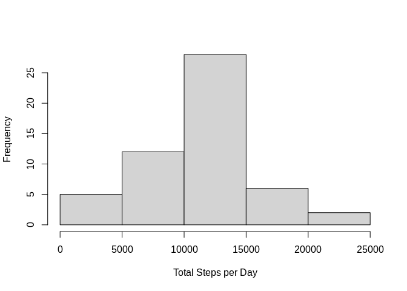
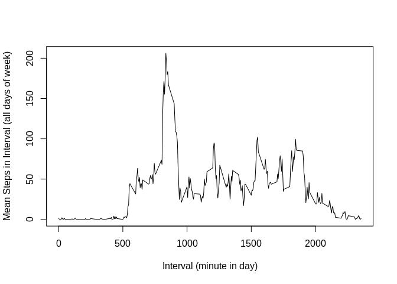
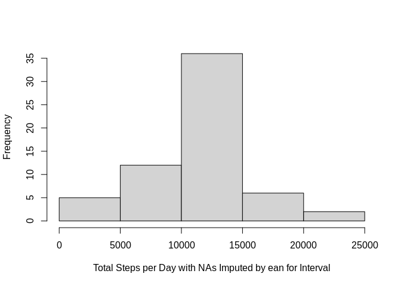
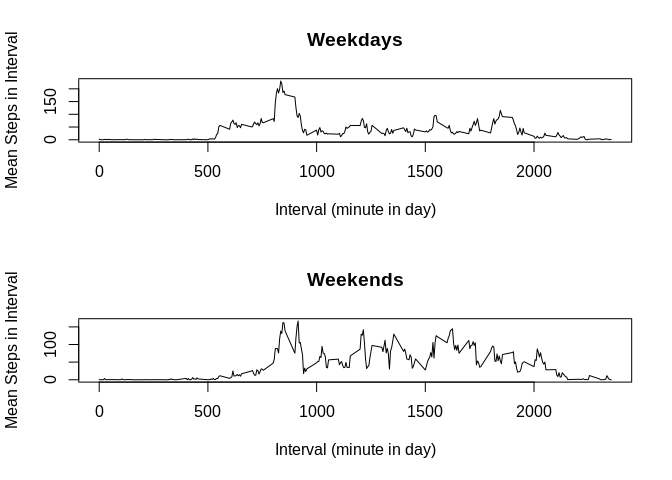

## Loading and preprocessing the data

Read in the .csv data from the .zip file


```r
step.data <- read.csv(unz("activity.zip","activity.csv"), quote="\"", sep=",", header = TRUE)
```

## What is mean total number of steps taken per day?

```r
steps.by.day <- aggregate(step.data$steps, by=list(step.data$date), FUN=sum)
hist(steps.by.day$x, xlab="Total Steps per Day", main="")
```

<!-- -->

```r
summary(aggregate(step.data$steps, by=list(step.data$date), FUN=sum)[,2])[c(4,3)]
```

```
##     Mean   Median 
## 10766.19 10765.00
```

## What is the average daily activity pattern?

```r
mean.steps.by.interval <- aggregate(na.omit(step.data)$steps, by=list(na.omit(step.data)$interval), FUN=mean)
plot(mean.steps.by.interval[,1],mean.steps.by.interval[,2],type='l',xlab = "Interval (minute in day)", ylab="Mean Steps in Interval (all days of week)")
```

<!-- -->


```r
max.activity <- mean.steps.by.interval[mean.steps.by.interval[,2] == max(mean.steps.by.interval[,2]),]
cat("Max activity for any period was ", max.activity[1,2], " at period ", max.activity[1,1])
```

```
## Max activity for any period was  206.1698  at period  835
```

## Imputing missing values

```r
cat("Number of intervals with missing values:", sum(is.na(step.data$steps)))
```

```
## Number of intervals with missing values: 2304
```

### histogram of average step per interval, with missing values replaced by mean for interval

```r
step.data.with.mean.by.interval <- merge(step.data, mean.steps.by.interval, by.x=3, by.y=1, all=TRUE)
na.intervals <- is.na(step.data.with.mean.by.interval$steps)
step.data.with.mean.by.interval[na.intervals,2] <-step.data.with.mean.by.interval[na.intervals, 4]
step.data.imputed <-step.data.with.mean.by.interval[,c(2,3,1)]
steps.by.day.imputed <- aggregate(step.data.imputed$steps, by=list(step.data.imputed$date), FUN=sum)
hist(steps.by.day.imputed$x, xlab="Total Steps per Day with NAs Imputed by ean for Interval",main="")
```

<!-- -->

### The mean and median number of steps per day with NA's replaced by interval mean

```r
summary(aggregate(step.data.imputed$steps, by=list(step.data.imputed$date), FUN=sum)[,2])[c(4,3)]
```

```
##     Mean   Median 
## 10766.19 10766.19
```

## Are there differences in activity patternsS between weekdays and weekends?

### Time series plots of mean steps per interval for weekdays and weekends

```r
step.data.imputed.with.dow <- cbind(step.data.imputed, dow=weekdays(as.Date(step.data.imputed$date)))
step.data.imputed.weekday <- 
  step.data.imputed.with.dow[step.data.imputed.with.dow$dow %in% c('Monday','Tuesday','Wednesday','Thursday','Friday'),]
step.data.imputed.weekend <- step.data.imputed.with.dow[step.data.imputed.with.dow$dow %in% c('Saturday','Sunday'),]
mean.steps.weekday <- aggregate(step.data.imputed.weekday$steps, by=list(step.data.imputed.weekday$interval), FUN=mean)
mean.steps.weekend <- aggregate(step.data.imputed.weekend$steps, by=list(step.data.imputed.weekend$interval), FUN=mean)
par(mfrow=c(2,1))
plot(mean.steps.weekday[,1],mean.steps.weekday[,2],type='l',xlab = "Interval (minute in day)", ylab="Mean Steps in Interval",main="Weekdays")
plot(mean.steps.weekend[,1],mean.steps.weekend[,2],type='l',xlab = "Interval (minute in day)", ylab="Mean Steps in Interval",main="Weekends")
```

<!-- -->
